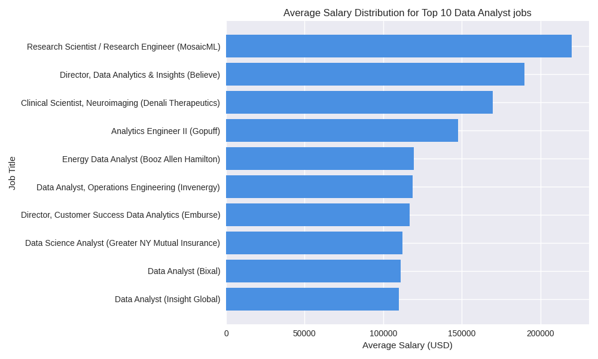
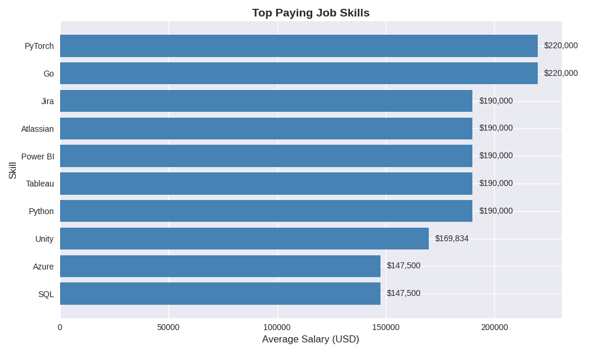
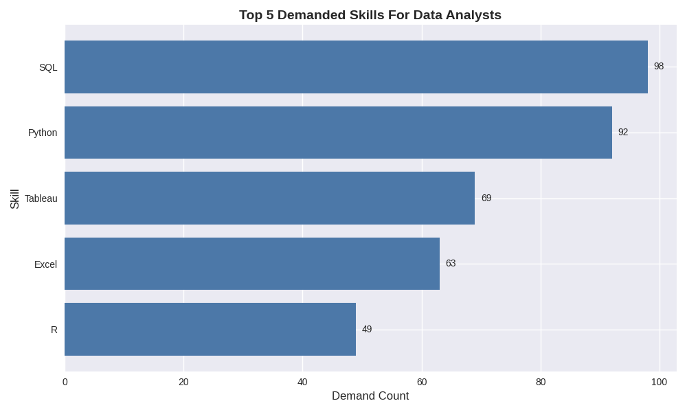
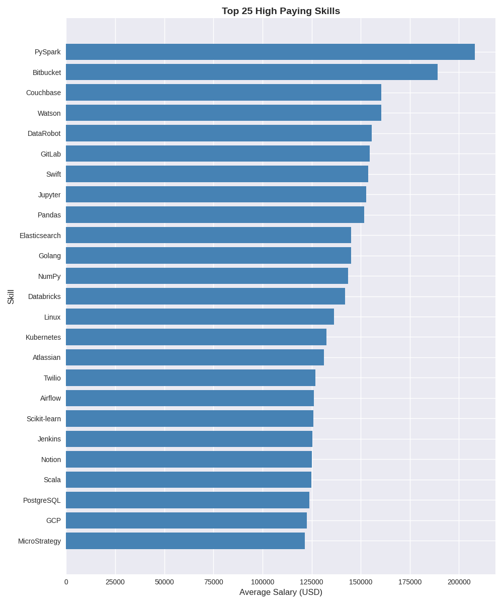

# Introduction
📊Insight into the data job market. Looking at data analyst positions, this project focuses on top-paying ✅ positions, 📈 in-demand skills, and where high demand is met by high salary in the data analyst field. 

SQL queries, check them out they can be found here:
[top_jobs folder](/top_jobs/)
# Background
Purpose of the project to explore the data analyst job market effectively, in was inspired from the desire to pinpoint high salary and in-demand skills for positions, streamlining the process of finding positions in the field.

### Insights that I wanted to gain through my SQL queries were:
1) What are the top-paying jobs in the field?
2) What skills are required for these top paying jobs?
3) What skills are the most in demand for data analyst in the job market?
4) Which skills are associated with higher salaries?
5) What are the most optimal skills to learn?


# Tools used
- **SQL:** The main tool of my analysis, allowing me to query the database and gain critical insights.
- **PostgreSQL:** The chosen database management system, ideal for handling the posting data.
- **Visual Studio Code:** Personal go to for database management and executing SQL queries.
- **Git and Github:** Version control and to share scripts and analysis.  
# The analysis
The queries are meant to analyze specific aspects of the data analyst job market.

### 1. Top paying Data Analyst Positions
```sql
SELECT
    job_id,
    job_title,
    job_location,
    job_schedule_type,
    salary_year_avg,
    job_posted_date,
    name AS company_name
FROM
    job_postings_fact
LEFT JOIN
    company_dim ON job_postings_fact.company_id = company_dim.company_id
WHERE
    job_title_short = 'Data Analyst' AND
    job_location = 'United States' AND
    salary_year_avg IS NOT NULL
ORDER BY
    salary_year_avg DESC
LIMIT 10;
```

### 2. Top paying job skills

```sql
WITH top_paying_jobs AS (

    SELECT
        job_id,
        job_title,
        salary_year_avg,
        name AS company_name
    FROM
        job_postings_fact
    LEFT JOIN
        company_dim ON job_postings_fact.company_id = company_dim.company_id
    WHERE
        job_title_short = 'Data Analyst' AND
        job_location = 'United States' AND
        salary_year_avg IS NOT NULL
    ORDER BY
        salary_year_avg DESC
    
)
SELECT 
    top_paying_jobs.*,
    skills
FROM top_paying_jobs
INNER JOIN skills_job_dim ON top_paying_jobs.job_id = skills_job_dim.job_id
INNER JOIN skills_dim ON skills_job_dim.skill_id = skills_dim.skill_id
ORDER BY
    salary_year_avg DESC
LIMIT 10;

```
### 3. Top demanded skills
```sql
SELECT 
    skills,
    COUNT(skills_job_dim.job_id) AS demand_count,
    job_location
FROM job_postings_fact
INNER JOIN skills_job_dim ON job_postings_fact.job_id = skills_job_dim.job_id
INNER JOIN skills_dim ON skills_job_dim.skill_id = skills_dim.skill_id
WHERE
    job_title_short = 'Data Analyst' AND 
    job_location = 'United States'
GROUP BY
    skills,
    job_location
ORDER BY
    demand_count DESC
LIMIT 5;
```
### 4. Top paying skills
```sql
SELECT 
    skills,
    ROUND(AVG(salary_year_avg),0) AS avg_salary
FROM job_postings_fact
INNER JOIN skills_job_dim ON job_postings_fact.job_id = skills_job_dim.job_id
INNER JOIN skills_dim ON skills_job_dim.skill_id = skills_dim.skill_id
WHERE
    job_title_short = 'Data Analyst' 
    AND salary_year_avg IS NOT NULL
    AND job_work_from_home = True
GROUP BY
    skills
   
ORDER BY
    avg_salary DESC

LIMIT 25;
```
### 5. Optimal skills
```sql
WITH skills_demand AS (
    SELECT 
        skills_dim.skill_id,
        skills_dim.skills,
        COUNT(skills_job_dim.job_id) AS demand_count
    FROM job_postings_fact
    INNER JOIN skills_job_dim 
        ON job_postings_fact.job_id = skills_job_dim.job_id
    INNER JOIN skills_dim 
        ON skills_job_dim.skill_id = skills_dim.skill_id
    WHERE
        job_title_short = 'Data Analyst' 
        AND salary_year_avg IS NOT NULL
        AND job_location = 'United States'
    GROUP BY
        skills_dim.skill_id, skills_dim.skills
),
average_salary AS (
    SELECT
        skills_job_dim.skill_id,
        ROUND(AVG(salary_year_avg),0) AS avg_salary
    FROM job_postings_fact
    INNER JOIN skills_job_dim 
        ON job_postings_fact.job_id = skills_job_dim.job_id
    INNER JOIN skills_dim 
        ON skills_job_dim.skill_id = skills_dim.skill_id
    WHERE
        job_title_short = 'Data Analyst' 
        AND salary_year_avg IS NOT NULL
        AND job_location = 'United States'
    GROUP BY
        skills_job_dim.skill_id
)
SELECT
    skills_demand.skill_id,
    skills_demand.skills,
    demand_count,
    avg_salary
FROM
    skills_demand
INNER JOIN average_salary 
    ON skills_demand.skill_id = average_salary.skill_id
ORDER BY
    demand_count DESC,
    avg_salary DESC
    
LIMIT 25;
```

### Visualizations of data using a bar graphs using the results from my SQL queries.

Top paying jobs




Top paying job skills



Top demanded skills



Top paying skills




Top 25 Optimal Skills

| Skill ID | Skill       | Demand Count | Avg. Salary ($) |
|----------|-------------|--------------|-----------------|
| 0        | SQL         | 20           | 87,683          |
| 182      | Tableau     | 16           | 92,220          |
| 1        | Python      | 15           | 101,538         |
| 181      | Excel       | 14           | 85,024          |
| 183      | Power BI    | 10           | 106,297         |
| 5        | R           | 8            | 86,363          |
| 188      | Word        | 8            | 78,873          |
| 195      | SharePoint  | 5            | 80,104          |
| 185      | Looker      | 3            | 121,483         |
| 8        | Go          | 3            | 121,167         |
| 61       | SQL Server  | 3            | 102,058         |
| 79       | Oracle      | 3            | 82,833          |
| 189      | SAP         | 3            | 77,933          |
| 196      | PowerPoint  | 3            | 74,695          |
| 198      | Outlook     | 3            | 74,023          |
| 4        | Java        | 3            | 73,388          |
| 80       | Snowflake   | 2            | 132,225         |
| 74       | Azure       | 2            | 118,500         |
| 78       | Redshift    | 2            | 101,244         |
| 197      | SSRS        | 2            | 97,500          |
| 7        | SAS         | 2            | 93,525          |
| 186      | SAS         | 2            | 93,525          |
| 13       | C++         | 2            | 87,269          |
| 76       | AWS         | 2            | 83,082          |
| 202      | MS Access   | 2            | 54,000          |


# Conclusions
### Top paying jobs:

    - Salary Range: These roles span from $110,000 (Insight Global) to $220,000 (MosaicML).
    - Top Tier Roles:
    - Research Scientist / Engineer (MosaicML) leads at $220K, reflecting advanced technical expertise in AI research.
    - Director, Data Analytics & Insights (Believe) follows at $190K, showing leadership positions command strong compensation.
    - Specialized Science Roles: The Clinical Scientist, Neuroimaging (Denali Therapeutics) earns ~$170K, highlighting niche expertise in biotech.
    - Mid-Level Engineering/Analytics: Roles like Analytics Engineer II (Gopuff) at $147.5K bridge technical depth with applied analytics.
    - General Analyst Positions: Salaries cluster between $110K–$120K, including Insight Global, Bixal, and Greater NY Mutual Insurance Company.

### Top paying job skills:


    - Go and PyTorch (MosaicML, Research Scientist / Engineer) lead at $220,000, reflecting the premium value of advanced programming and deep learning frameworks in AI research.
    - Strong Director-Level Skills:
    - Python, Tableau, Power BI, Atlassian, and Jira (Believe, Director of Data Analytics & Insights) each command $190,000, showing that leadership roles require both technical and project management tools.
    - Specialized Science Tools:
    - Unity (Denali Therapeutics, Clinical Scientist, Neuroimaging) earns ~$170K, highlighting the importance of visualization and simulation in biotech.
    - Core Data Engineering Skills:
    - SQL and Azure (Gopuff, Analytics Engineer II) are valued at $147,500, showing strong demand for database management and cloud expertise.
### Top demand:

    - SQL (98 postings) is the most demanded skill, confirming its role as the backbone of data analysis.
    - Python (92 postings) is nearly as popular, reflecting the growing importance of automation, machine learning, and advanced analytics.
    - Tableau (69 postings) shows strong demand for visualization tools, highlighting the need to communicate insights effectively.
    - Excel (63 postings) remains a staple, proving that even with advanced tools, spreadsheet skills are still critical.
    - R (49 postings), while less in demand than Python, continues to be valued in statistical and academic contexts.
### Top skills:

    - PySpark leads with an average salary of $208,172, showing the premium value of big data processing frameworks in analytics.
    - Version Control & Collaboration Tools:
    - Bitbucket ($189,155) and GitLab ($154,500) highlight how modern DevOps and collaborative coding platforms are highly valued in analyst roles.
    - Specialized Tools:
    - Couchbase and Watson both average $160,515, reflecting demand for NoSQL databases and AI-driven platforms.
    - DataRobot ($155,486) emphasizes the rising importance of automated machine learning platforms.
    - Programming & Libraries:
    - Swift ($153,750), Pandas ($151,821), NumPy ($143,513), and Scala ($124,903) show that diverse programming languages and data libraries remain lucrative.
    - Cloud & Infrastructure:
    - Databricks ($141,907), Kubernetes ($132,500), PostgreSQL ($123,879), and GCP ($122,500) demonstrate strong compensation for cloud-native and database expertise.
    - Visualization & Workflow Tools:
    - Jupyter ($152,777) and Airflow ($126,103) highlight the value of reproducible workflows and orchestration in analytics pipelines.
    - Other Notables:
    - Elasticsearch ($145,000) for search and indexing, Twilio ($127,000) for communication APIs, and MicroStrategy ($121,619) for BI platforms round out the list.
### Optimal skills:

    - Snowflake ($132K), Looker ($121K), and Go ($121K) lead the salary rankings, though demand is low (2–3 postings).
    - Azure ($118K) also commands strong pay, reflecting the premium for cloud expertise.

    Best Demand + Salary Balance:
    - Python ($101K, 15 postings) and Power BI ($106K, 10 postings) stand out as optimal skills: high demand and high salaries.
    - SQL ($87K, 20 postings) remains the most requested skill, making it indispensable despite lower pay compared to niche tools.

    Lower-Paying Baseline Skills:
    - MS Access ($54K), Outlook ($74K), and PowerPoint ($74K) sit at the bottom, showing they’re expected baseline office tools rather than differentiators.
    - These skills don’t drive salary growth but are often required for business operations.
